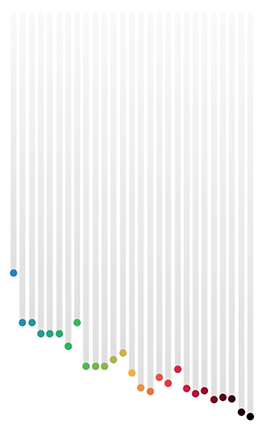

# Desafio de visualização de dados

 Desenvolva uma animação para web a partir de uma planilha de dados.

 Crie um fork desse projeto e, quando concluído, faça um pull request dele para esse repositório.

 ---

## Critérios obrigatórios que a animação precisará ter

- Comparação animada entre o tempo de todos os medalhistas dos 100m rasos nas Olimpíadas masculino ou feminino, mas não os dois
- A informação deve ser precisa e de acordo com a planilha de dados nesse repositório
- Controles de animação: iniciar, pausar e reiniciar
- Utilizar preprocessadores de HTML, CSS e JS (Webpack ou Gulp preferencialmente)
- JS de controle da animação deve ser em ES6

Essas são as regras, fora isso tudo é válido. Utilize as bibliotecas que quiser, as técnicas que achar mais interessante. Se quiser incrementar a proposta, ótimo.

---

## Recursos

### Animação

Como referência utilize o [vídeo](./animation/animation.mp4) encontrado na pasta `animation`. Você pode estilizar seu vídeo como desejar.

### Dados

Na pasta `data/data.tsv` existe uma planilha separada por tabs. Utilize os valores nela contida para gerar a animação
